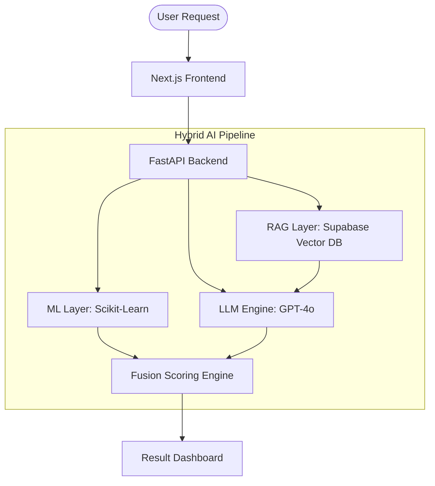

# 🛡️ HOAXGUARD AI
### Hybrid Misinformation Detection & Evidence Reasoning System

**HoaxGuard AI** is a production-ready hybrid engineering solution designed to combat misinformation with a multi-layered approach. It combines statistical precision, real-world evidence retrieval, and advanced cognitive reasoning.

---

## 🚀 Key Features

- **Layer 1: ML Detection** – Ultra-fast statistical analysis using TF-IDF and Logistic Regression (51k+ dataset).
- **Layer 2: RAG Retrieval** – Real-time evidence grounding using Supabase and pgvector.
- **Layer 3: LLM Reasoning** – Contextual analysis and contradiction checking with GPT-4o.
- **Fusion Scoring** – Probabilistic weighted fusion `(0.4*ML + 0.6*LLM)` for high-accuracy verdicts.
- **Explainable AI (XAI)** – Clear reasoning steps and source citations for every analysis.

---

## 🛠️ Architecture



---

## 📦 Project Structure

- `/backend`: FastAPI application and AI core.
  - `/core`: ML, RAG, LLM, and Fusion modules.
  - `/models`: Pre-trained Scikit-Learn models.
- `/frontend`: Next.js web application.
  - `/app`: App router components and pages.
  - `/styles`: Premium design system.

---

## 🚦 Getting Started

### 1. Backend Setup
```bash
cd backend
pip install -r requirements.txt
# Edit .env with your Supabase and OpenAI keys
python app.py
```

### 2. Frontend Setup
```bash
cd frontend
npm install
npm run dev
```

---

## 🎯 Target Use Cases
- **Workshop Demo**: Showcasing hybrid AI workflows.
- **Pitch Deck**: Presenting a scalable engineering solution for social good.
- **GitHub**: Professional-grade documentation for a misinformation detection framework.

---

**Developed for Indonesia's Digital Safety Ecosystem.** 🇮🇩
